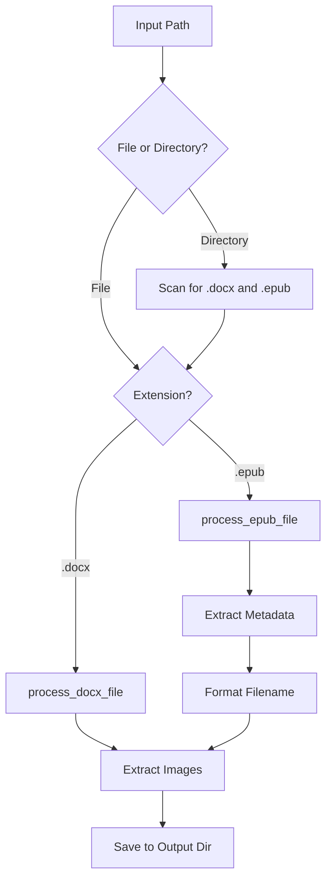

# EPUB Support Implementation Plan

## Overview

Add EPUB file support to the Word-Image-Extractor tool, enabling extraction of images from EPUB files with smart naming based on book metadata (author and title).

## Current State Analysis

The existing application (`src/main.rs`) is a Rust CLI tool that:
- Extracts images from `.docx` files (which are ZIP archives internally)
- Supports single file or directory processing (with optional recursion)
- Filters by image format (png, jpg, gif, etc.)
- Names output files based on the source document filename

### Key Current Functions:
- [`process_file()`](src/main.rs:62) - Processes a single .docx file
- [`get_supported_extensions()`](src/main.rs:34) - Returns supported image formats
- Uses `zip` crate for archive handling

## EPUB Format Background

EPUB files are also ZIP archives containing:
- `META-INF/container.xml` - Points to the content.opf file
- `content.opf` or similar - Contains metadata (author, title) and manifest
- `OEBPS/` or similar directory - Contains HTML content and images
- Images typically in formats: jpg, png, gif, svg

## Proposed Implementation

### 1. Dependencies

Add the `epub` crate to `Cargo.toml`:

```toml
[dependencies]
epub = "2.1.4"
```

This crate provides:
- `EpubDoc::new()` - Open EPUB files
- `doc.mdata("title")` - Get title metadata
- `doc.mdata("creator")` - Get author/creator metadata  
- `doc.resources` - Access to all resources including images

### 2. Architecture Changes



### 3. Code Structure

#### Option A: Inline in main.rs (Simple)
Add EPUB processing directly in [`main.rs`](src/main.rs) alongside existing code.

#### Option B: Modular Approach (Recommended)
Create separate modules for cleaner organization:

```
src/
├── main.rs          # CLI and orchestration
├── docx.rs          # DOCX-specific processing  
├── epub.rs          # EPUB-specific processing
└── common.rs        # Shared utilities (image extraction, filename handling)
```

### 4. Key Functions to Implement

#### `process_epub_file()`
```rust
fn process_epub_file(
    input_path: &Path,
    output_base_dir: &Path,
    allowed_extensions: &HashSet<&str>,
) -> Result<usize>
```

This function will:
1. Open EPUB using `EpubDoc::new()`
2. Extract metadata:
   - Title: `doc.mdata("title")`
   - Author: `doc.mdata("creator")`
3. Generate base filename: `"{Author} - {Title}"` or fallback to file stem
4. Iterate through `doc.resources` to find images
5. Extract images matching allowed extensions
6. Save with appropriate naming

#### `format_epub_filename()`
```rust
fn format_epub_filename(author: Option<&str>, title: Option<&str>, fallback: &str) -> String
```

Logic:
- If both author and title exist: `"Author - Title"`
- If only title exists: `"Title"`
- If only author exists: `"Author"`
- If neither exists: Use original filename (fallback)

Also sanitize the result to remove invalid filename characters.

### 5. Changes to Existing Code

#### `main.rs` modifications:

1. **Update file type detection** in the directory scanning logic (lines ~217-258):
   - Add `.epub` extension recognition alongside `.docx`

2. **Update the process dispatch** (line ~206):
   - Check file extension and route to appropriate processor
   - Call `process_docx_file()` for .docx
   - Call `process_epub_file()` for .epub

3. **Update CLI descriptions**:
   - Change "input .docx file or directory" to "input .docx/.epub file or directory"

### 6. Filename Sanitization

Create a helper function to sanitize filenames:
```rust
fn sanitize_filename(name: &str) -> String {
    name.chars()
        .map(|c| match c {
            '/' | '\\' | ':' | '*' | '?' | '"' | '<' | '>' | '|' => '_',
            _ => c,
        })
        .collect()
}
```

### 7. Image Extraction from EPUB

The `epub` crate provides:
```rust
// Get list of all resources
for (id, (path, mime_type)) in &doc.resources {
    if mime_type.starts_with("image/") {
        let data = doc.get_resource(id)?;
        // Save image data
    }
}
```

Alternatively, use the raw zip access since EPUB files are ZIP archives (reuse existing logic).

## Output Naming Examples

| Scenario        | Author         | Title         | Filename                                       |
| --------------- | -------------- | ------------- | ---------------------------------------------- |
| Both present    | "Stephen King" | "The Shining" | `Stephen King - The Shining_1.png`             |
| Only title      | None           | "The Shining" | `The Shining_1.png`                            |
| Only author     | "Stephen King" | None          | `Stephen King_1.png`                           |
| Neither         | None           | None          | `original_filename_1.png`                      |
| Multiple images | "Author"       | "Title"       | `Author - Title_1.png`, `Author - Title_2.jpg` |

## Testing Considerations

1. Test with EPUBs that have:
   - Complete metadata
   - Missing author
   - Missing title
   - Missing both
   - Multiple images
   - Various image formats
   - EPUB 2 and EPUB 3 format variations

2. Test mixed directories with both .docx and .epub files

3. Test filename sanitization with special characters in metadata

## README Updates

Update [`README.md`](README.md) to:
- Mention EPUB support in features
- Add EPUB-specific usage examples
- Document the "Author - Title" naming convention
- Note that metadata fallback uses original filename

## Implementation Order

1. Add `epub` dependency to `Cargo.toml`
2. Create `process_epub_file()` function
3. Create `format_epub_filename()` helper
4. Create `sanitize_filename()` helper
5. Update main file type detection and routing
6. Update CLI help text
7. Update README documentation
8. Test with sample EPUB files

## Risks and Mitigations

| Risk                          | Mitigation                                                                       |
| ----------------------------- | -------------------------------------------------------------------------------- |
| EPUB crate incompatibility    | The `epub` crate (v2.1.4) is actively maintained and uses compatible zip version |
| Memory usage with large EPUBs | Process images one at a time, don't load all into memory                         |
| Invalid metadata characters   | Sanitize all metadata before using in filenames                                  |
| EPUB format variations        | The `epub` crate handles EPUB 2 and 3 formats                                    |
